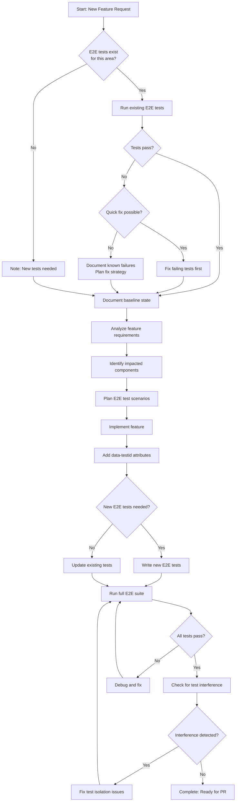

# E2E-First Feature Development Workflow

**Status:** Active
**Version:** 1.0
**Last Updated:** 2025-11-20

---

## Overview

The E2E-First Feature Development Workflow ensures quality and prevents regressions by **verifying E2E tests BEFORE implementing features**. This workflow treats E2E tests as the source of truth for feature behavior.

**Core Principle:** "Test First, Implement Second, Verify Always"

---

## Workflow Decision Tree



---

## Phase 1: Pre-Implementation E2E Verification

**Goal:** Establish a known-good baseline before making changes.

### Step 1.1: Identify Relevant E2E Tests

```bash
# Search for tests related to feature area
npx playwright test --list | grep -i "feature-name"

# Example: For character management feature
npx playwright test --list | grep -i "character"
```

**Relevant Test Files:**
- Check `e2e/` directory structure
- Look for tests covering related pages/components
- Check `e2e/failed-tests.json` for known issues

### Step 1.2: Run Baseline Tests

```bash
# Terminal 1: Start backend in E2E mode (high rate limits)
cd backend && npm run dev:e2e

# Terminal 2: Start frontend
npm run dev

# Terminal 3: Run related tests
npx playwright test e2e/character-management.spec.ts --workers=1 --max-failures=1
```

**Important:**
- Always use `npm run dev:e2e` for backend (10,000 req/15min vs 500)
- Use `--workers=1` for initial verification (avoid parallelization issues)
- Use `--max-failures=1` to stop on first failure

### Step 1.3: Evaluate Baseline Results

**If tests pass:**
✅ Document results: "Baseline E2E tests passing (X tests, Y assertions)"

**If tests fail:**
```bash
# Check if failures are known
cat e2e/failed-tests.json | grep "test-name"

# If known → Proceed (document as known issue)
# If unknown → Investigate
```

**Decision Matrix:**

| Scenario | Action | Proceed with Feature? |
|----------|--------|----------------------|
| All tests pass | Document baseline | ✅ Yes |
| Known failures only | Document known issues | ✅ Yes |
| New failures (quick fix) | Fix tests first | ⏸️ After fix |
| New failures (complex) | Document + plan fix | ⚠️ With caution |
| No tests exist | Note for creation | ✅ Yes |

### Step 1.4: Fix Failing Tests (If Applicable)

```typescript
// Common E2E test fixes

// ✅ CORRECT: Use data-testid selectors
await page.getByTestId('character-name-input').fill('Test Character');

// ❌ WRONG: Brittle CSS/text selectors
await page.locator('.input-field').first().fill('Test Character');

// ✅ CORRECT: Wait for state changes
await page.getByTestId('save-button').click();
await expect(page.getByTestId('success-message')).toBeVisible();

// ❌ WRONG: Hardcoded waits
await page.getByTestId('save-button').click();
await page.waitForTimeout(1000); // Flaky!
```

**Update `failed-tests.json` if needed:**
```bash
# After fixing a test, remove it from failed tests
npm run sync-failed-tests
```

---

## Phase 2: Feature Analysis

**Goal:** Understand what needs to be built and how to test it.

### Step 2.1: Analyze Requirements

**Questions to Answer:**
1. What is the user story?
2. Which pages/components are affected?
3. What are the happy path scenarios?
4. What are the edge cases?
5. What are the error scenarios?

**Document Answers:**
```markdown
## Feature: Add Character Traits

**User Story:** As a user, I want to add custom traits to characters.

**Affected Areas:**
- CharacterCard component
- Character detail page
- Character service (backend)

**Happy Path:**
1. User clicks "Add Trait" button
2. User enters trait name and description
3. User clicks "Save"
4. Trait appears in character's trait list

**Edge Cases:**
- Empty trait name
- Duplicate trait name
- Very long trait description

**Error Scenarios:**
- API failure during save
- Validation errors
- Network timeout
```

### Step 2.2: Identify Impacted Components

```bash
# Find components related to feature
npx glob "src/**/*Character*.tsx"

# Search for related API calls
npx grep -r "api/characters" src/

# Check backend routes
npx grep -r "router.post.*character" backend/src/routes/
```

### Step 2.3: Plan E2E Test Scenarios

**Test Planning Template:**
```typescript
// e2e/character-traits.spec.ts (PLANNED)

test.describe('Character Traits', () => {

  test('should add a new trait to character', async ({ page }) => {
    // Happy path
    // 1. Navigate to character detail page
    // 2. Click "Add Trait" button
    // 3. Fill trait form
    // 4. Save trait
    // 5. Verify trait appears in list
  });

  test('should validate empty trait name', async ({ page }) => {
    // Edge case: Empty input
    // 1. Navigate to character detail page
    // 2. Click "Add Trait" button
    // 3. Leave name empty, click Save
    // 4. Verify validation error shown
  });

  test('should handle API failure gracefully', async ({ page }) => {
    // Error scenario: API down
    // 1. Mock API failure
    // 2. Attempt to add trait
    // 3. Verify error message shown
    // 4. Verify UI remains usable
  });
});
```

**Test Isolation Checklist:**
- ✅ Each test creates its own data (no shared state)
- ✅ Tests can run in parallel without conflicts
- ✅ Tests clean up after themselves (or use database reset)
- ✅ No hardcoded IDs or assumptions about existing data

---

## Phase 3: Implementation

**Goal:** Build the feature following project standards.

### Step 3.1: Implement Feature

**Follow Project Standards:**
- **DRY** - Don't Repeat Yourself
- **SOLID** - Single Responsibility, Open/Closed, etc.
- **Pure ESM** - No CommonJS syntax
- **Type Safety** - Use TypeScript strictly
- **Component Isolation** - Keep components focused

**Example Implementation:**
```typescript
// src/components/CharacterTraits.tsx

import { useState } from 'react';
import { characterService } from '@/services/character.service';

interface Trait {
  id: string;
  name: string;
  description: string;
}

interface CharacterTraitsProps {
  characterId: string;
  traits: Trait[];
  onTraitsChange: (traits: Trait[]) => void;
}

export function CharacterTraits({ characterId, traits, onTraitsChange }: CharacterTraitsProps) {
  const [isAdding, setIsAdding] = useState(false);
  const [error, setError] = useState<string | null>(null);

  const handleAddTrait = async (name: string, description: string) => {
    try {
      setError(null);
      const newTrait = await characterService.addTrait(characterId, { name, description });
      onTraitsChange([...traits, newTrait]);
      setIsAdding(false);
    } catch (err) {
      setError(err instanceof Error ? err.message : 'Failed to add trait');
    }
  };

  return (
    <div data-testid="character-traits">
      {error && <div data-testid="trait-error" role="alert">{error}</div>}

      <ul data-testid="traits-list">
        {traits.map(trait => (
          <li key={trait.id} data-testid={`trait-${trait.id}`}>
            {trait.name}
          </li>
        ))}
      </ul>

      {!isAdding && (
        <button
          data-testid="add-trait-button"
          onClick={() => setIsAdding(true)}
        >
          Add Trait
        </button>
      )}

      {isAdding && (
        <form
          data-testid="trait-form"
          onSubmit={(e) => {
            e.preventDefault();
            const formData = new FormData(e.currentTarget);
            handleAddTrait(
              formData.get('name') as string,
              formData.get('description') as string
            );
          }}
        >
          <input
            data-testid="trait-name-input"
            name="name"
            required
          />
          <textarea
            data-testid="trait-description-input"
            name="description"
          />
          <button data-testid="save-trait-button" type="submit">
            Save
          </button>
          <button
            data-testid="cancel-trait-button"
            type="button"
            onClick={() => setIsAdding(false)}
          >
            Cancel
          </button>
        </form>
      )}
    </div>
  );
}
```

### Step 3.2: Add data-testid Attributes

**Critical Rule:** Every interactive element MUST have a `data-testid` attribute.

**Naming Convention:**
```typescript
// Pattern: {component}-{element}-{type}

data-testid="character-traits"              // Container
data-testid="traits-list"                   // List container
data-testid="trait-123"                     // Dynamic item (use ID)
data-testid="add-trait-button"              // Action button
data-testid="trait-name-input"              // Form input
data-testid="save-trait-button"             // Submit button
data-testid="trait-error"                   // Error message
```

**Why data-testid?**
- ✅ Stable across styling changes
- ✅ Explicit testing contract
- ✅ Easy to find in tests
- ❌ CSS selectors break when styles change
- ❌ Text selectors break with i18n or copy changes

### Step 3.3: Follow Backend Integration Workflow

**If backend endpoint needed:**

```typescript
// backend/src/routes/character.ts

router.post('/:characterId/traits', async (req, res) => {
  const { characterId } = req.params;
  const { name, description } = req.body;

  // Validation
  if (!name?.trim()) {
    return res.status(400).json({ error: 'Trait name is required' });
  }

  // Create trait
  const trait = await characterService.addTrait(characterId, { name, description });

  res.json({ success: true, trait });
});
```

**Update frontend service:**
```typescript
// src/services/character.service.ts

export const characterService = {
  async addTrait(characterId: string, data: { name: string; description: string }) {
    const response = await fetch(`${API_BASE_URL}/api/characters/${characterId}/traits`, {
      method: 'POST',
      headers: { 'Content-Type': 'application/json' },
      body: JSON.stringify(data),
    });

    if (!response.ok) {
      const error = await response.json();
      throw new Error(error.error || 'Failed to add trait');
    }

    const { trait } = await response.json();
    return trait;
  }
};
```

**CRITICAL: Test in browser before marking complete!**
1. Start both servers (`npm run dev` + `npm run dev:backend`)
2. Open browser, trigger the feature
3. Check Network tab for request/response
4. Verify no console errors

---

## Phase 4: E2E Test Addition/Update

**Goal:** Add comprehensive E2E tests for the new feature.

### Step 4.1: Write New E2E Tests

```typescript
// e2e/character-traits.spec.ts

import { test, expect } from '@playwright/test';
import { login, createTestCharacter, cleanupTestData } from './helpers';

test.describe('Character Traits', () => {
  let characterId: string;

  test.beforeEach(async ({ page }) => {
    // Setup: Create test character
    await login(page);
    characterId = await createTestCharacter(page, { name: 'Test Character' });
    await page.goto(`/characters/${characterId}`);
  });

  test.afterEach(async () => {
    // Cleanup: Remove test data
    await cleanupTestData({ characterId });
  });

  test('should add a new trait to character', async ({ page }) => {
    // Arrange: Navigate to character page
    await expect(page.getByTestId('character-traits')).toBeVisible();

    // Act: Add trait
    await page.getByTestId('add-trait-button').click();
    await page.getByTestId('trait-name-input').fill('Brave');
    await page.getByTestId('trait-description-input').fill('Shows courage in danger');
    await page.getByTestId('save-trait-button').click();

    // Assert: Trait appears in list
    await expect(page.getByTestId('traits-list')).toContainText('Brave');

    // Assert: Form closed
    await expect(page.getByTestId('trait-form')).not.toBeVisible();
  });

  test('should validate empty trait name', async ({ page }) => {
    // Arrange
    await page.getByTestId('add-trait-button').click();

    // Act: Try to save without name
    await page.getByTestId('save-trait-button').click();

    // Assert: Validation error shown (HTML5 validation prevents submission)
    await expect(page.getByTestId('trait-name-input')).toHaveAttribute('required');
    await expect(page.getByTestId('trait-form')).toBeVisible(); // Form still open
  });

  test('should handle duplicate trait names', async ({ page }) => {
    // Arrange: Add first trait
    await page.getByTestId('add-trait-button').click();
    await page.getByTestId('trait-name-input').fill('Brave');
    await page.getByTestId('save-trait-button').click();
    await expect(page.getByTestId('traits-list')).toContainText('Brave');

    // Act: Try to add duplicate
    await page.getByTestId('add-trait-button').click();
    await page.getByTestId('trait-name-input').fill('Brave');
    await page.getByTestId('save-trait-button').click();

    // Assert: Error shown
    await expect(page.getByTestId('trait-error')).toContainText('already exists');
  });

  test('should cancel trait creation', async ({ page }) => {
    // Arrange
    await page.getByTestId('add-trait-button').click();
    await page.getByTestId('trait-name-input').fill('Brave');

    // Act: Cancel
    await page.getByTestId('cancel-trait-button').click();

    // Assert: Form closed, no trait added
    await expect(page.getByTestId('trait-form')).not.toBeVisible();
    await expect(page.getByTestId('traits-list')).toBeEmpty();
  });

  test('should handle API failure gracefully', async ({ page }) => {
    // Arrange: Mock API failure
    await page.route('**/api/characters/*/traits', route => {
      route.fulfill({ status: 500, body: JSON.stringify({ error: 'Server error' }) });
    });

    // Act: Try to add trait
    await page.getByTestId('add-trait-button').click();
    await page.getByTestId('trait-name-input').fill('Brave');
    await page.getByTestId('save-trait-button').click();

    // Assert: Error shown, UI still usable
    await expect(page.getByTestId('trait-error')).toContainText('Failed to add trait');
    await expect(page.getByTestId('add-trait-button')).toBeVisible(); // Can retry
  });
});
```

### Step 4.2: Update Existing Tests (If Needed)

**If feature changes existing behavior:**

```typescript
// e2e/character-management.spec.ts

test('should display character with traits', async ({ page }) => {
  // This test now needs to account for traits section

  const character = await createTestCharacter(page, {
    name: 'Hero',
    traits: [{ name: 'Brave', description: 'Courageous' }] // New field
  });

  await page.goto(`/characters/${character.id}`);

  await expect(page.getByTestId('character-name')).toContainText('Hero');
  await expect(page.getByTestId('character-traits')).toBeVisible(); // New assertion
  await expect(page.getByTestId('traits-list')).toContainText('Brave'); // New assertion
});
```

### Step 4.3: Test Isolation Best Practices

**✅ DO:**
```typescript
// Each test creates its own data
test.beforeEach(async ({ page }) => {
  characterId = await createTestCharacter(page, { name: `Test-${Date.now()}` });
});

// Each test cleans up after itself
test.afterEach(async () => {
  await cleanupTestData({ characterId });
});
```

**❌ DON'T:**
```typescript
// Shared state across tests (breaks parallelization)
let sharedCharacterId: string;

test.beforeAll(async ({ page }) => {
  sharedCharacterId = await createTestCharacter(page, { name: 'Shared' });
});

test('test 1', async ({ page }) => {
  // Modifies shared character
  await page.goto(`/characters/${sharedCharacterId}`);
  await page.getByTestId('delete-button').click();
});

test('test 2', async ({ page }) => {
  // Fails because character was deleted in test 1!
  await page.goto(`/characters/${sharedCharacterId}`);
});
```

---

## Phase 5: Verification

**Goal:** Ensure all tests pass and no regressions introduced.

### Step 5.1: Run Updated E2E Suite

```bash
# Run all E2E tests
npx playwright test --workers=1 --max-failures=1

# Run specific test file
npx playwright test e2e/character-traits.spec.ts --workers=1

# Run in UI mode (for debugging)
npx playwright test --ui

# Run with trace (for debugging failures)
npx playwright test --trace on
```

### Step 5.2: Verify All Tests Pass

**If tests fail:**

1. **Check test output:**
   ```bash
   npx playwright show-report
   ```

2. **Common failure causes:**
   - Missing `data-testid` attribute
   - Timing issue (element not ready)
   - API not responding (backend not running in E2E mode)
   - Test isolation issue (shared state)

3. **Debug with trace:**
   ```bash
   npx playwright test --trace on
   npx playwright show-trace trace.zip
   ```

4. **Debug with UI mode:**
   ```bash
   npx playwright test --ui
   # Click "Pick Locator" to verify selectors work
   ```

### Step 5.3: Check for Test Interference

**Monitoring System Integration:**

The codebase has a test monitoring system that detects interference between tests.

```bash
# Check for interference
cat e2e/failed-tests.json

# Look for patterns:
# - Test passes alone but fails in suite → Shared state issue
# - Test fails intermittently → Race condition or timing issue
# - Test fails after specific test → Cleanup issue
```

**Common Interference Patterns:**

| Pattern | Cause | Fix |
|---------|-------|-----|
| Test A passes alone, fails after Test B | Test B doesn't clean up | Add `afterEach` cleanup to Test B |
| Test fails 50% of the time | Race condition | Add proper `await expect().toBeVisible()` |
| Test fails in parallel, passes with `--workers=1` | Shared database state | Use unique IDs for test data |

### Step 5.4: Fix Failing Tests

**Example: Timing Issue**

```typescript
// ❌ WRONG: Hardcoded wait
await page.getByTestId('save-button').click();
await page.waitForTimeout(1000); // Flaky!
await expect(page.getByTestId('success-message')).toBeVisible();

// ✅ CORRECT: Wait for state change
await page.getByTestId('save-button').click();
await expect(page.getByTestId('success-message')).toBeVisible(); // Auto-waits
```

**Example: Test Isolation Issue**

```typescript
// ❌ WRONG: Reuses same character ID
const characterId = 'test-character-123';

test('test 1', async ({ page }) => {
  await createCharacter({ id: characterId, name: 'Hero' });
  await page.goto(`/characters/${characterId}`);
  await page.getByTestId('delete-button').click(); // Deletes it!
});

test('test 2', async ({ page }) => {
  await page.goto(`/characters/${characterId}`); // 404 - character deleted!
});

// ✅ CORRECT: Each test creates unique data
test('test 1', async ({ page }) => {
  const id = await createCharacter({ name: 'Hero' }); // Generates unique ID
  await page.goto(`/characters/${id}`);
  await page.getByTestId('delete-button').click();
});

test('test 2', async ({ page }) => {
  const id = await createCharacter({ name: 'Hero' }); // Different character
  await page.goto(`/characters/${id}`);
});
```

---

## Phase 6: Completion Checklist

**Before marking feature complete, verify:**

### ✅ Pre-Implementation
- [ ] Ran existing E2E tests for affected areas
- [ ] Documented baseline state (passing/failing)
- [ ] Fixed pre-existing failures (if feasible)
- [ ] Identified test gaps

### ✅ Implementation
- [ ] Feature implemented following project standards
- [ ] All interactive elements have `data-testid` attributes
- [ ] Backend endpoint tested in browser (if applicable)
- [ ] Frontend service calls real backend (no mocks)
- [ ] TypeScript types match backend response
- [ ] Error handling implemented

### ✅ E2E Tests
- [ ] New E2E tests added for new functionality
- [ ] Existing tests updated for behavior changes
- [ ] Tests use `data-testid` selectors (not CSS/text)
- [ ] Tests are isolated (parallel-safe)
- [ ] Tests have proper setup/cleanup

### ✅ Verification
- [ ] All E2E tests pass (`npx playwright test`)
- [ ] No test interference detected
- [ ] Tested in browser manually
- [ ] No console errors
- [ ] Network requests succeed

### ✅ Code Quality
- [ ] Follows DRY principle
- [ ] Follows SOLID principles
- [ ] Pure ESM (no CommonJS)
- [ ] Type-safe (TypeScript)
- [ ] Component isolation maintained

---

## Common Pitfalls

### Pitfall 1: Skipping Pre-Implementation Verification

**❌ WRONG:**
```
"I'll just implement the feature and add tests later."
```

**Why it fails:**
- Unknown baseline state
- Can't distinguish new failures from old ones
- May break existing functionality without knowing

**✅ CORRECT:**
```
1. Run existing tests first
2. Document baseline
3. Then implement
```

### Pitfall 2: Using Brittle Selectors

**❌ WRONG:**
```typescript
await page.locator('.btn.btn-primary').click(); // CSS classes change!
await page.getByText('Save').click(); // Copy changes with i18n!
await page.locator('button').first().click(); // Order changes with refactoring!
```

**✅ CORRECT:**
```typescript
await page.getByTestId('save-button').click(); // Stable contract
```

### Pitfall 3: Not Testing Error Scenarios

**❌ WRONG:**
```typescript
test('should add trait', async ({ page }) => {
  // Only tests happy path
  await page.getByTestId('add-trait-button').click();
  await page.getByTestId('trait-name-input').fill('Brave');
  await page.getByTestId('save-trait-button').click();
  await expect(page.getByTestId('traits-list')).toContainText('Brave');
});
```

**✅ CORRECT:**
```typescript
test('should add trait', async ({ page }) => {
  // Happy path
});

test('should validate empty name', async ({ page }) => {
  // Validation error
});

test('should handle API failure', async ({ page }) => {
  // Network error
});

test('should handle duplicate names', async ({ page }) => {
  // Business logic error
});
```

### Pitfall 4: Shared State Between Tests

**❌ WRONG:**
```typescript
let characterId: string;

test.beforeAll(async () => {
  characterId = await createCharacter(); // Shared across all tests
});

test('test 1', async ({ page }) => {
  // Modifies shared character
});

test('test 2', async ({ page }) => {
  // Depends on test 1 NOT modifying character
});
```

**✅ CORRECT:**
```typescript
test.beforeEach(async () => {
  characterId = await createCharacter(); // New character per test
});

test.afterEach(async () => {
  await cleanupCharacter(characterId); // Clean up
});
```

### Pitfall 5: Not Using E2E Backend Mode

**❌ WRONG:**
```bash
# Backend in normal mode (500 req/15min)
cd backend && npm run dev

# Tests hit rate limit after ~5 tests
npx playwright test
```

**✅ CORRECT:**
```bash
# Backend in E2E mode (10,000 req/15min)
cd backend && npm run dev:e2e

# Tests won't hit rate limit
npx playwright test
```

### Pitfall 6: Marking Feature Complete Without Browser Testing

**❌ WRONG:**
```
1. Implement backend endpoint
2. Update frontend service
3. Add E2E tests
4. ✅ Mark complete (never tested in browser!)
```

**✅ CORRECT:**
```
1. Implement backend endpoint
2. Update frontend service
3. Open browser, manually test feature
4. Check Network tab for request/response
5. Verify no console errors
6. Add E2E tests
7. ✅ Mark complete
```

---

## Agent/Command Integration

### When to Use Specialized Agents

**Implementation Agent:**
```typescript
// Use for complex feature implementation
Task({
  subagent_type: "implementation",
  description: "Implement character traits feature",
  prompt: "Implement character traits following E2E-First workflow..."
});
```

**QA Triage Agent:**
```typescript
// Use for investigating test failures
Task({
  subagent_type: "qa-triage",
  description: "Investigate E2E test failures",
  prompt: "Analyze failing tests in e2e/character-traits.spec.ts..."
});
```

**Agent Creator:**
```typescript
// Use if new specialized agent needed
Task({
  subagent_type: "agent-creator",
  description: "Create E2E test debugging agent",
  prompt: "Create agent specialized in debugging Playwright test failures..."
});
```

### Creating Slash Commands for Repetitive Tasks

**Example: Create `/run-e2e` command:**

```bash
# .claude/commands/run-e2e.md

Run E2E tests with proper backend setup:

1. Check if backend is running in E2E mode
2. Start backend with `npm run dev:e2e` if needed
3. Run Playwright tests with `--workers=1 --max-failures=1`
4. Report results
```

**Usage:**
```
/run-e2e character-traits
```

---

## Summary

**E2E-First Workflow in 6 Phases:**

1. **Pre-Implementation Verification** - Establish baseline
2. **Feature Analysis** - Plan test scenarios
3. **Implementation** - Build with testability
4. **E2E Test Addition** - Comprehensive test coverage
5. **Verification** - Ensure quality
6. **Completion Checklist** - Validate all requirements

**Key Principles:**
- Test first, implement second, verify always
- Use `data-testid` for stable selectors
- Test isolation (parallel-safe tests)
- Always run E2E tests before and after
- Test error scenarios, not just happy paths
- Use browser testing before marking complete

**Benefits:**
- Catch regressions early
- Prevent broken functionality
- Ensure feature quality
- Build confidence in codebase
- Enable safe refactoring

---

**Last Updated:** 2025-11-20
**Version:** 1.0
**Status:** Active
