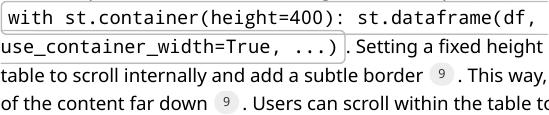
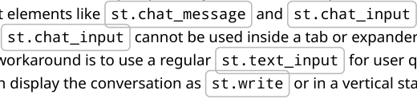
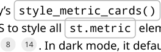
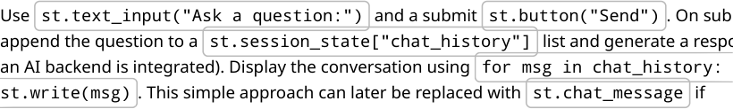
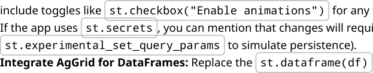

# **Improving the Crypto Portfolio Dashboard UI/UX**

**Objective:** Refactor the Streamlit app into a cleaner, modular dashboard layout **without breaking existing**
**functionality** . We'll preserve the dark theme and current features, but reduce clutter by grouping related
elements and introducing navigational structure.

## **Current UI Challenges and Goals**


**Clutter & Scrolling:** The single-page layout shows too many charts, metrics, and forms at once,
requiring excessive scrolling. This makes it hard for users to focus on key insights.
**Unstructured Presentation:** All content (portfolio table, summary metrics, P&L chart, etc.) is
stacked vertically. There’s no clear separation between high-level summary and detailed data.
**Control Panel Overload:** The sidebar lists a multi-select for assets and numerous price override
inputs (one per asset), which can become unwieldy if many assets are selected.
**Design Goal:** Evolve to a **dashboard-like interface** – using tabs or collapsible sections for different
functionalities (Portfolio, Analysis, Chat, Settings). This will let users navigate between sections
instead of seeing everything at once.
**Maintain Dark Theme:** Keep the current dark mode styling for consistency. Any new components or
custom styles should support dark mode (e.g. using dark-friendly colors).
**Enhance Readability:** Use cards, grids, or grouped panels to display key metrics and charts. This
grouping of related info aligns with best practices for dashboards [1](https://blog.streamlit.io/crafting-a-dashboard-app-in-python-using-streamlit/#:~:text=1,concise%20labels%20to%20describe%20metrics) .


[1](https://blog.streamlit.io/crafting-a-dashboard-app-in-python-using-streamlit/#:~:text=1,concise%20labels%20to%20describe%20metrics)


## **Sidebar Input Controls – Organization & Grouping**

The left sidebar will remain the control center (asset selection and price overrides), but we'll make it more
compact and readable:


**Asset Selector:** Keep the **multi-select** for assets at the top of the sidebar (as is). This is essential for
filtering the portfolio.
**Price Overrides Section:** Enclose the override inputs in a collapsible container for better grouping.
For example, use an expander:


`with st.sidebar.expander("` 💰 `Price Overrides", expanded=False):`

```
   st.markdown("*Override live prices for what-if scenarios*")
   # ... loop through assets and st.sidebar.number_input for each ...

```

Using `st.expander` will hide these inputs under a header by default, so they’re only visible when needed


[2](https://docs.streamlit.io/develop/api-reference/layout/st.expander#:~:text=Insert%20a%20multi,can%20be%20expanded%2Fcollapsed) . This prevents the sidebar from becoming extremely long when many assets are selected. When

collapsed, only the label “Price Overrides” is shown, decluttering the sidebar [3](https://docs.streamlit.io/develop/api-reference/layout/st.expander#:~:text=Inserts%20a%20container%20into%20your,visible%20is%20the%20provided%20label) .


[2](https://docs.streamlit.io/develop/api-reference/layout/st.expander#:~:text=Insert%20a%20multi,can%20be%20expanded%2Fcollapsed)


[3](https://docs.streamlit.io/develop/api-reference/layout/st.expander#:~:text=Inserts%20a%20container%20into%20your,visible%20is%20the%20provided%20label)


- **Align and Limit Inputs:** Within the expander, inputs can be arranged in columns to save space.

Streamlit’s sidebar doesn’t support `st.columns` directly, but you can simulate a grid by alternating


1


the placement of inputs or using HTML/CSS if necessary. Another approach is to use a scrolling
container for the overrides list. For example, if the overrides are numerous, wrap them in

`st.container(height=300)` so that the sidebar itself doesn’t overflow (the container will scroll


**Apply/Refresh Controls:** Retain the **“ Refresh Data”** button, but consider grouping it with the
overrides (e.g. inside the expander or right below it) so that all pricing controls are in one place.
Optionally, you could convert the overrides and refresh into a form submit pattern:
Use `st.form` in the sidebar for the overrides and refresh button. This way, the user can adjust


multiple overrides and then click **Apply** once, rather than triggering a rerun on every number input
change. This improves UX for bulk edits (currently each `st.number_input` triggers immediate


rerun).


By reorganizing the sidebar in this way, users can easily configure inputs without being overwhelmed by a
long list of fields.

## **Main Panel Layout – Tabs for Sections**


The core content will be split into **multiple tabs** (or similarly, top-level expanders or pages) to create a
modular interface. Streamlit supports tabs natively, which lets us separate content logically [5](https://docs.streamlit.io/develop/api-reference/layout/st.tabs#:~:text=import%20streamlit%20as%20st) :


    - **Implement Tabs:** Use `st.tabs()` to create tabs for **Portfolio**, **Analysis**, **Chat**, and **Settings** . For


example:


`tab1, tab2, tab3, tab4 = st.tabs([" Portfolio", "` 📊 `Analysis", " Chat", "` ⚙

```
 Settings"])

 with tab1:

   # Portfolio overview content

 with tab2:

   # Analysis content

 ...

```

This will produce clickable tabs that users can switch between, with the first tab (Portfolio) shown by default

[5](https://docs.streamlit.io/develop/api-reference/layout/st.tabs#:~:text=import%20streamlit%20as%20st) . Each `with tabX:` block contains the UI elements for that section. All tabs’ content is still computed


on load (Streamlit renders all tabs upfront [6](https://docs.streamlit.io/develop/api-reference/layout/st.tabs#:~:text=Note) ), but the user will only see one at a time, greatly reducing on
screen clutter.


    - **Tab: Portfolio (Overview)** – This tab will present the main portfolio summary. We’ll include:

    - **Key Metrics Cards:** At the top, show high-level portfolio metrics (Total Value, Total Cost, Realized

P&L, Unrealized P&L, Total Return). Instead of burying these below the table as in the current design,
surface them prominently. Use `st.columns` to arrange them in a single row or two rows. For

example, a single row of five metrics (if space allows) or a 2×3 grid. Each metric can be displayed with

`st.metric()` .


◦


_Card Styling:_ To improve the visual emphasis, style these metric boxes as **cards** . Streamlit now
allows containers with borders, which can be used to create card-like highlights [7](https://arnaudmiribel.github.io/streamlit-extras/extras/metric_cards/#:~:text=Restyle%20metrics%20as%20cards%20with,nice%20cards%20with%20a%20border) . For
instance, you can wrap each `st.metric` in `st.container(border=True)` to give it a


bordered box appearance. In dark mode, the container border will adapt to a dark color by


2


default [7](https://arnaudmiribel.github.io/streamlit-extras/extras/metric_cards/#:~:text=Restyle%20metrics%20as%20cards%20with,nice%20cards%20with%20a%20border) [8](https://arnaudmiribel.github.io/streamlit-extras/extras/metric_cards/#:~:text=) . Alternatively, use the `streamlit-extras` utility


`style_metric_cards()` to automatically apply a card style to all metrics (with proper dark


theme colors) [7](https://arnaudmiribel.github.io/streamlit-extras/extras/metric_cards/#:~:text=Restyle%20metrics%20as%20cards%20with,nice%20cards%20with%20a%20border) . This will make metrics visually distinct, like dashboard KPI cards.

**Portfolio Value Table:** The detailed table of assets (the DataFrame with Amount, Cost €, Value €,

etc.) can be displayed below the metrics. To avoid it consuming too much space, **make it collapsible**

**or scrollable** :


◦ One option is to put the table inside an `st.expander("` 📊 `Detailed Portfolio",`


◦


◦


`expanded=True)` so that users can collapse it if they just want the summary. The expander


label can show a summary like “Detailed Portfolio (n assets)”.
Another option is to constrain its height. For example,





overall page remains compact.

◦ You may combine both: a container inside an expander for maximum control (collapsed by

default, and scrollable when expanded).
**Portfolio Charts & Highlights:** Next to or below the table, include the P&L visualization and key
asset highlights:

◦ Retain the **P&L bar chart** (realized vs unrealized P&L). You can keep this in a column beside

the table for a wide-screen layout. In a two-column layout, the left 2/3 can hold table +
metrics, and the right 1/3 can hold the chart and other info (as currently coded). Ensure to
give this chart a clear title (e.g. “Unrealized vs Realized P&L”).

◦ **Best/Worst Asset** indicators (the🏆 Best and 📉 Worst performers) should remain visible.


◦


◦


◦


◦


These can be placed below the chart in the right column or highlighted in their own small
cards. For example, use `st.success` and `st.error` as currently, or turn them into


colored metric cards. Since they are essentially single-value highlights, you could use

`st.metric` with an emoji in the label for consistency.


**Active Overrides Notice:** If any price overrides are active, continue to display them, but
perhaps as an alert or badge. For instance, a small `st.info` box listing overridden assets


can appear at the top or bottom of the Portfolio tab. This could also be in an expander (like
“Active Price Overrides”) if you want to keep it hidden unless needed.


By structuring the Portfolio tab with clearly separated sections (summary cards, table, chart, etc.), users can
grasp the overall status at a glance and then drill into details if desired.


**Tab: Analysis** – This section is for deeper analysis and additional visualizations that don’t fit in the

main overview. Possible content:
**Time-Series Performance:** Provide a chart showing portfolio value or profit over time. For example,
an interactive line chart of total portfolio value by date. This could be built with Streamlit’s built-in


`st.line_chart` or Altair. For richer interaction (zooming, tooltips), consider using **Plotly** or


**streamlit-echarts** :


◦ Using `streamlit-echarts`, you can create highly customizable charts. You prepare an


ECharts options dictionary and call `st_echarts(options)` [10](https://github.com/andfanilo/streamlit-echarts#:~:text=from%20streamlit_echarts%20import%20st_echarts) [11](https://github.com/andfanilo/streamlit-echarts#:~:text=%7B,%5D%2C%20%7D%20st_echarts%28options%3Doptions) . This allows features


like tooltips, legends to toggle assets, and a dark theme mode for charts. (Ensure to install via


`pip install streamlit-echarts` ).


3


◦


Alternatively, use Plotly via `st.plotly_chart()`, which also supports interactive pan/zoom


and is natively supported in Streamlit.
**Asset Allocation and Breakdown:** Include charts such as a pie chart or bar chart of portfolio
allocation by asset, or a correlation heatmap of asset returns. These give more analytical insight:

◦ A pie or donut chart could show percentage of total value per asset. The `streamlit-`


◦


`echarts` library can render pie charts easily, or use Plotly’s pie chart.


◦ A bar chart comparing metrics (like cost vs value for each asset) could also live in this tab.

**Advanced Tables:** If you have more data (like trade history or monthly P&L), present it here. For
instance, a table of all transactions or a summary of realized gains per year could be in an expander
in Analysis.
**Layout in Analysis:** You can use sub-headers or even sub-tabs inside this tab if there are multiple
distinct analyses. For example, within the Analysis tab, use another set of


◦


`st.tabs(["Performance Over Time", "Allocation", ...])` to toggle between different

analyses. This keeps the Analysis section itself organized if it grows.


The Analysis tab is intentionally separate from the Portfolio overview so that the main tab stays focused,
and power users can dig into these additional charts as needed.


**Tab: Chat** – A dedicated section for interactive Q&A or chatbot functionality, allowing the user to
query their portfolio or get explanations:
Implement a chat interface where the user can ask questions (e.g., “What is my total profit?” or
“Which asset performed best this month?”) and get answers. Under the hood this might integrate
with an AI model or custom logic, but from a UI perspective you need a text input and a chat log.





- Design the chat interface to occupy the full tab, perhaps with an expander for chat history if needed.

Keep the styling simple and consistent with dark theme (Streamlit chat elements automatically
adjust to dark mode).


- The Chat tab ensures that any conversational or assistive features are isolated from the main

dashboard, avoiding confusion.


- **Tab: Settings** – A section for configuration and less-frequently used options:


- **API Keys & Credentials:** Provide inputs for the Bitvavo API key/secret here, instead of requiring an


storage appropriately).
**Preferences:** Any user preferences can be managed here. For instance, a toggle for currency (EUR vs
USD), switching the theme (though you plan to keep dark mode, you could still allow a light mode
toggle if desired), or adjusting the refresh interval for data.
**Layout Settings:** If you want to allow the user to customize the dashboard (like which sections to
expand by default, or how many assets to show), settings is a good place for those controls.


4


   - Use `st.checkbox` or `st.selectbox` for such options. The Settings tab content won’t be needed


often, so keeping it separate prevents clutter on the main interface.


By using these four tabs, the app becomes a **multi-section dashboard** . The user’s workflow would typically

be: adjust filters in the sidebar → view Portfolio tab for overview → navigate to Analysis for deeper insight

or Chat for questions → use Settings rarely. This separation improves user flow, as they won’t need to scroll
up and down one long page; instead, they can jump to the section of interest.

## **Improved Layout of Metrics and Charts**


Within each tab, we will further use a **grid layout** (columns and containers) to make efficient use of space
and avoid long vertical stacking:


**Use Columns for Metrics:** As noted, important metrics should be laid out in columns (one metric
per column) rather than a vertical list. This takes advantage of wide monitors and groups related
metrics side by side [13](https://blog.streamlit.io/crafting-a-dashboard-app-in-python-using-streamlit/#:~:text=3,concise%20labels%20to%20describe%20metrics) . In Streamlit, `st.columns` can take a list of relative widths. For example,


`st.columns([1,1,1,1,1])` will create 5 equal-width columns. We can place _Total Value_, _Total_


_Cost_, _Realized P&L_, _Unrealized P&L_, _Total Return_ each in one column as `st.metric` (with appropriate


labels and values). Grouping metrics together like this makes comparisons easy (the user can scan
across metrics without scrolling) [13](https://blog.streamlit.io/crafting-a-dashboard-app-in-python-using-streamlit/#:~:text=3,concise%20labels%20to%20describe%20metrics) .
**Card Design for Metrics:** Make each metric stand out by using card-style design:
The simplest method is wrapping each metric in `st.container(border=True)` to add a subtle


[13](https://blog.streamlit.io/crafting-a-dashboard-app-in-python-using-streamlit/#:~:text=3,concise%20labels%20to%20describe%20metrics)


border around it [7](https://arnaudmiribel.github.io/streamlit-extras/extras/metric_cards/#:~:text=Restyle%20metrics%20as%20cards%20with,nice%20cards%20with%20a%20border) . This visually separates the metrics from the background. You might also add a
slight background color by customizing the theme or using HTML/CSS (ensuring it’s compatible with

dark mode).

For a more polished look, the **st-extras** library’s `style_metric_cards()` can be called after


creating all metrics. This will inject custom CSS to style all `st.metric` elements with a background,


[7](https://arnaudmiribel.github.io/streamlit-extras/extras/metric_cards/#:~:text=Restyle%20metrics%20as%20cards%20with,nice%20cards%20with%20a%20border)




border, and even a colored left border accent [8](https://arnaudmiribel.github.io/streamlit-extras/extras/metric_cards/#:~:text=) [14](https://arnaudmiribel.github.io/streamlit-extras/extras/metric_cards/#:~:text=Border%20color.%20Defaults%20to%20%22,292D34%22%20in%20dark%20mode) . In dark mode, it defaults to a dark card

background ( `#292D34` ) and lighter border, which aligns with your theme.


- Example usage: after creating metrics, call `style_metric_cards()` (after `pip install`


`streamlit-extras` ) – it requires an import as shown in the docs [15](https://arnaudmiribel.github.io/streamlit-extras/extras/metric_cards/#:~:text=Import%3A) .


**Columns for Charts and Data:** Continue using column layouts to place charts next to data where it

makes sense:

In the **Portfolio** tab, the two-column layout (overview vs. sidebar column) is already used. We can
maintain a similar approach: e.g., left column for the table and perhaps some metrics, right column
for the P&L chart and best/worst metrics. Since we plan to put the key KPI metrics at the very top
spanning the full width, you can then create a new `st.columns([2,1])` below that. In the wider


left portion, put the detailed table (possibly in an expander or container), and in the right narrower
portion, put the bar chart and the best/worst info. This matches the current structure and keeps
related info together, but now it's within the **Portfolio tab** only.

- In the **Analysis** tab, if you have multiple charts (say a line chart and a pie chart), consider placing

them side by side in one row if they are both important. For instance, `col1, col2 =`


others are supplemental, you can stack them with appropriate headings.


5


- Use `st.container` or `st.expander` as needed to group related charts. For example, an


expander titled "Detailed Analysis ⚙" could hold a secondary chart or data that advanced users
might want, without overwhelming others.

- **Data Tables with Ag-Grid:** For interactive data tables (sorting, filtering), consider replacing

`st.dataframe` with **Ag-Grid** via the `streamlit-aggrid` component. Ag-Grid will allow users to

sort columns, filter results, and even edit data in-place if needed. The integration is straightforward:

- Install the component with `pip install streamlit-aggrid`, then import and use it. For


example, [16](https://docs.streamlit.io/develop/concepts/custom-components#:~:text=For%20example%2C%20to%20use%20the,you%20first%20install%20it%20with) :

```
  from st_aggrid import AgGrid
  AgGrid(df)

```

This single call will render the DataFrame in an interactive grid with default settings [17](https://docs.streamlit.io/develop/concepts/custom-components#:~:text=3,For%20AgGrid%2C%20this%20step%20is) . You can
customize AgGrid options (like enabling pagination, setting grid height, etc.) using

`GridOptionsBuilder` as needed [18](https://staggrid-examples.streamlit.app/#:~:text=Getting%20Started%20with%20AgGrid%20The,from%20the%20dataframe%20and%20render) .


The benefit is a more **dashboard-like table** experience: columns can be resized, and the user can
scan large tables more easily. This improves UX especially if the portfolio has many assets or

transactions.
If using AgGrid, ensure the dark theme styling is enabled so it matches (AgGrid offers theme options
such as "ag-theme-balham-dark").
**Consistent Theming:** Make sure all components – whether native or third-party – use a dark theme.
Many streamlit components detect the app theme automatically or have dark variants. For example,
Plotly charts can be given a template like `plotly_dark` . If using custom HTML/CSS (for cards or


other tweaks), use colors that fit the dark background (e.g., avoid pure white backgrounds; use the
Streamlit default card color or slightly transparent panels).

- **Use of Icons/Emojis:** Continue using emojis in section headers and metric labels for quick visual

cues (📈 for analytics, 💰 for prices, etc.). Just ensure they are used sparingly and consistently, so the


design looks professional and not cluttered.

## **Transitions and User Flow Improvements**


Beyond layout, we want to ensure the app feels responsive and intuitive:


**Smooth Transitions:** Streamlit doesn’t support animated transitions between tabs or expanders, but
we can simulate a smooth experience by controlling what is shown by default. For instance, keep
non-critical sections collapsed initially (e.g., the price overrides expander, detailed table expander).
This way, when the app loads, the user sees a concise dashboard. They can then “reveal” sections on
demand – this acts like a manual transition where content is revealed gradually, aligning with the
“light reveal effects” goal.
**Loading Indicators:** Continue using `st.spinner` when fetching data (already implemented for


price fetch and portfolio calc). This gives feedback during long computations. You might also use
placeholders (e.g., an empty chart or “Loading…” text) that gets updated, to avoid any flicker. For


- **Prevent Jarring Re-runs:** When widgets change (asset selection or number inputs), the app reruns.

With the new layout, consider using **Session State** to preserve which tab or expander the user was


6


on before a rerun. This avoids the annoyance of being kicked back to the first tab after every update.
You can store the current tab name in `st.session_state` and use conditional logic to show that


tab as active on reload (though Streamlit tabs don’t have a direct way to set the active tab, you could
use URL query params or a radio instead of tabs for true persistence).
**Guide the User Flow:** On initial load, the **Portfolio** tab will display. Ensure this tab gives a great
overview (as described) so the user immediately sees total portfolio performance. Clear section
headings (like “Portfolio Summary”, “Allocation Chart”, etc.) should guide the user’s eyes. If the user
needs to take action (e.g., no assets selected or API failure), show an informative message in that tab
(as currently done with warnings and errors). Because tabs hide content, the user might miss an
error placed in another tab – so handle errors within the relevant tab context.
**Chat Interaction Flow:** If implementing the Chat tab, ensure that sending a message doesn’t
navigate away or disrupt the other tabs. The user should be able to flip back to Portfolio or Analysis,

and then return to Chat with the conversation still there. Utilize session state to store the chat

history so it persists across app reruns (so that each new message doesn’t clear past messages).
**Settings Persistence:** Any settings changed in the Settings tab (like API keys or preferences) should
immediately reflect in the app state (or prompt the user to refresh if needed). Using


`st.session_state` for these can allow real-time updates (e.g., if user switches base currency, the

Portfolio tab could recalc values in that currency on the fly).

## **Component Integration and Libraries**


To implement the above improvements, leverage Streamlit’s layout APIs and these components:


    - **Streamlit Tabs & Expanders:** Core to the redesign – use `st.tabs` for main sections [5](https://docs.streamlit.io/develop/api-reference/layout/st.tabs#:~:text=import%20streamlit%20as%20st) and


`st.expander` for optional sub-sections (e.g., overrides, detailed tables) [2](https://docs.streamlit.io/develop/api-reference/layout/st.expander#:~:text=Insert%20a%20multi,can%20be%20expanded%2Fcollapsed) . These require minimal


code changes but dramatically improve structure.

    - **st.columns and st.container:** Already used in the app, but will be used more extensively to create

grid layouts and card containers. For example, using `st.container(border=True)` provides a


bordered box that can serve as a card [7](https://arnaudmiribel.github.io/streamlit-extras/extras/metric_cards/#:~:text=Restyle%20metrics%20as%20cards%20with,nice%20cards%20with%20a%20border), and `st.container(height=...)` creates scrollable


areas for long content [9](https://docs.streamlit.io/develop/api-reference/layout/st.container#:~:text=Desired%20height%20of%20the%20container,the%20rest%20of%20the%20app) .
**st.metric and st.metric_delta:** Continue to use for numeric highlights. Combine with the styling
approach (containers or `style_metric_cards` ) to enhance their appearance as cards.


[9](https://docs.streamlit.io/develop/api-reference/layout/st.container#:~:text=Desired%20height%20of%20the%20container,the%20rest%20of%20the%20app)


- **Third-Party Components:**

- **AgGrid (streamlit-aggrid):** Replace `st.dataframe` with `AgGrid` for the portfolio table to allow

interactive sorting/filtering. Implement as shown in docs (install, import, then `AgGrid(df)` to


display) [16](https://docs.streamlit.io/develop/concepts/custom-components#:~:text=For%20example%2C%20to%20use%20the,you%20first%20install%20it%20with) [19](https://docs.streamlit.io/develop/concepts/custom-components#:~:text=4,use%20it%21%20For%20AgGrid%2C%20that%27s) . This makes the data exploration more powerful without additional clutter.
**Streamlit-ECharts:** Use for advanced charts in Analysis tab. For example, to plot a time series line
chart, prepare an ECharts `options` dict and call `st_echarts(options)` . The usage is


[16](https://docs.streamlit.io/develop/concepts/custom-components#:~:text=For%20example%2C%20to%20use%20the,you%20first%20install%20it%20with) [19](https://docs.streamlit.io/develop/concepts/custom-components#:~:text=4,use%20it%21%20For%20AgGrid%2C%20that%27s)


straightforward – the component takes a dict matching ECharts JSON config [10](https://github.com/andfanilo/streamlit-echarts#:~:text=from%20streamlit_echarts%20import%20st_echarts) [11](https://github.com/andfanilo/streamlit-echarts#:~:text=%7B,%5D%2C%20%7D%20st_echarts%28options%3Doptions) . This library
allows adding toolboxes, multiple axes, and rich interactions which can elevate the Analysis section

visuals.

**streamlit-elements (optional):** If you want a more custom dashboard layout (drag-and-drop panels,
resizable windows, etc.), `streamlit-elements` could be explored. It provides a React Grid Layout


[10](https://github.com/andfanilo/streamlit-echarts#:~:text=from%20streamlit_echarts%20import%20st_echarts) [11](https://github.com/andfanilo/streamlit-echarts#:~:text=%7B,%5D%2C%20%7D%20st_echarts%28options%3Doptions)


integration where components can be placed in a flexible grid. This is a more advanced
enhancement – consider it if you need highly interactive layout features beyond what `st.columns`


provides [20](https://github.com/okld/streamlit-elements#:~:text=GitHub%20github,Nivo%20charts%2C%20and%20more) . For the current scope, you might not need this, as Streamlit’s built-ins plus a few
components suffice.


7


    - **Animation/Styling Libraries:** There isn’t a specific animation library for Streamlit, but you can use

CSS tricks or small JavaScript via components if needed. For example, subtle CSS transitions on
container appearance could be added with `st.markdown(..., unsafe_allow_html=True)` if


you want, but this is optional. Keep animations minimal to maintain app responsiveness.

## **Implementation Plan Summary**


Following these steps will help a developer (or coding assistant) implement the redesign:


1.


2.


3.


4.


5.


6.


7.


8.


9.


10.


11.


12.


13.

14.


15.


16.


17.


Optionally, implement a form for overrides + refresh to batch updates.
**Initialize Tabs:** In the main content (after `st.sidebar` config), create `st.tabs` for _Portfolio_,

_Analysis_, _Chat_, _Settings_ [5](https://docs.streamlit.io/develop/api-reference/layout/st.tabs#:~:text=import%20streamlit%20as%20st) . Capture the returned tab objects.
**Move Content into Tabs:** Cut and paste the existing content into the appropriate `with tab:`


blocks:

Portfolio tab: include the title, description, and **Controls** check for assets (the warnings if no assets).
Then all current portfolio calculations, table, metrics, chart, etc., go here.
Analysis tab: (If not much exists yet, create a placeholder text like “Coming soon: more analysis.”)

Plan to add charts like time-series or allocation here.

Chat tab: For now, perhaps a placeholder as well (“Chat with your portfolio assistant here.”).
Implementing full chat can be a separate task, but structure is ready.
Settings tab: Provide input fields for API keys or any config. At minimum, you can move the API
missing warning here or allow the user to input keys.
**Portfolio Tab Layout:** Inside the Portfolio `with` block:


Create a `st.columns` for the top summary metrics. Populate with `st.metric` values (Total


Value, etc.). Use formatting for currency and percentages as before.
Style the metrics: import and call `style_metric_cards()` **after** creating the metrics (or wrap


metrics in containers with border=True).

Below metrics, implement the two-column layout for table and chart: `col1, col2 =`


`st.columns([2, 1])` (similar to existing code [21](https://github.com/BerryKuipers/crypto-insight/blob/08d3bbe2de46a81a5e31f8b46d54c66fd4dfc358/src/portfolio/ui.py#L256-L265) ). In `col1`, put the portfolio DataFrame. Use an


expander or container for it to control height/visibility as discussed. In `col2`, put the


`create_pnl_chart(df)` call and the best/worst metrics and overrides info.


Adjust subheaders as needed (e.g., “Portfolio Overview” might now be unnecessary if the tab itself is

labeled Portfolio; instead use “Detailed Breakdown” for the table section, “P&L Chart” for the chart

section, etc., as subheaders).

**Analysis Tab Content:** Build out one or two sample charts:
Example: calculate a timeseries of total value over time (if you have time-indexed data). If not readily
available, perhaps show a static chart like cumulative returns using the existing data for

demonstration.

Use `st.altair_chart` or `st.plotly_chart` for quick implementation. For a fancier chart, set


up `streamlit_echarts` : `pip install` the package, then use an `options` dict (as shown in


their README) to render a chart.

Ensure to add descriptive captions or tooltips. This tab can also include text analysis or commentary
on the portfolio performance.
**Chat Tab Implementation:** If the chat feature is planned, stub it out:


8


18.


19.


20.

21.


22.


23.


24.

25.


26.


27.


28.

29.


30.




supported.
Mark this section clearly so it doesn’t interfere with other parts (since chat might not be
implemented immediately, keep it isolated).
**Settings Tab Implementation:** Add inputs for config:


reinitialize the API client. You might incorporate a button to test the connection. Also, you could



```
 from st_aggrid import AgGrid, GridOptionsBuilder
 options = GridOptionsBuilder.from_dataframe(df).build()
 AgGrid(df, gridOptions=options, theme="balham") # or "streamlit" theme if

 available

```

This will render the portfolio table in an interactive grid. Test that sorting and filtering work. Ensure
numeric formats are preserved (you may need to specify column types in GridOptionsBuilder).
**Test Responsiveness:** Run the app and verify:
On load, the Portfolio tab shows summary cards at top, table/chart below. The sidebar is neat
(overrides hidden initially). No errors.
Selecting/deselecting assets updates the data properly and stays on the same tab. If not, implement

session state to remember tab.

The dark theme is consistent across all components (if some third-party component shows a light
background, adjust its theme setting).
Collapse and expand behaviors: collapsing the table or price overrides should not break any state.
Try the app in a smaller window or mobile (the layout should gracefully stack columns vertically if
screen is narrow – Streamlit does this automatically).
**Polish Text & Labels:** Go through all labels and ensure they are concise and clear:

◦ Sidebar controls should have tooltips ( `help="..."` already used in code) – verify they still


make sense in the new layout.


◦


◦


◦


Tab names should include icons and clear text (they do in the example above, e.g. "⚙

Settings").
Section subheaders should be used sparingly inside tabs since the tab itself is already a
context. But do use subheaders to start major groups within a tab (like “Portfolio Summary”,
“Performance Analysis”, etc.), which helps break up content.
Remove redundant text that may no longer apply (for instance, the main title "Crypto
Portfolio FIFO P&L Dashboard" could remain at the very top of the app or be moved into the
sidebar as a logo/title, since the tabs now delineate sections).


By following this plan, the app will transform into a **modular dashboard** : the sidebar provides input
controls in a tidy manner, and the main area is divided into intuitive tabs. The **Portfolio** tab gives a concise


9


overview (using cards and a cleaner layout), the **Analysis** tab can host rich visualizations without crowding
the overview, the **Chat** tab enables a novel way to interact, and **Settings** keeps configuration out of the
main view. This structure addresses the original UX issues (no more endless scrolling or information
overload) while preserving all functionality and data. Users will find it easier to navigate and interact with
the app, all while enjoying the same dark-themed aesthetic and real-time capabilities of the original design.


[1](https://blog.streamlit.io/crafting-a-dashboard-app-in-python-using-streamlit/#:~:text=1,concise%20labels%20to%20describe%20metrics) [13](https://blog.streamlit.io/crafting-a-dashboard-app-in-python-using-streamlit/#:~:text=3,concise%20labels%20to%20describe%20metrics)


Building a dashboard in Python using Streamlit


[https://blog.streamlit.io/crafting-a-dashboard-app-in-python-using-streamlit/](https://blog.streamlit.io/crafting-a-dashboard-app-in-python-using-streamlit/)


[2](https://docs.streamlit.io/develop/api-reference/layout/st.expander#:~:text=Insert%20a%20multi,can%20be%20expanded%2Fcollapsed) [3](https://docs.streamlit.io/develop/api-reference/layout/st.expander#:~:text=Inserts%20a%20container%20into%20your,visible%20is%20the%20provided%20label)


st.expander - Streamlit Docs


[https://docs.streamlit.io/develop/api-reference/layout/st.expander](https://docs.streamlit.io/develop/api-reference/layout/st.expander)


[4](https://docs.streamlit.io/develop/api-reference/layout/st.container#:~:text=height%20) [9](https://docs.streamlit.io/develop/api-reference/layout/st.container#:~:text=Desired%20height%20of%20the%20container,the%20rest%20of%20the%20app)


st.container - Streamlit Docs


[https://docs.streamlit.io/develop/api-reference/layout/st.container](https://docs.streamlit.io/develop/api-reference/layout/st.container)


[5](https://docs.streamlit.io/develop/api-reference/layout/st.tabs#:~:text=import%20streamlit%20as%20st) [6](https://docs.streamlit.io/develop/api-reference/layout/st.tabs#:~:text=Note)


st.tabs - Streamlit Docs


[https://docs.streamlit.io/develop/api-reference/layout/st.tabs](https://docs.streamlit.io/develop/api-reference/layout/st.tabs)


[7](https://arnaudmiribel.github.io/streamlit-extras/extras/metric_cards/#:~:text=Restyle%20metrics%20as%20cards%20with,nice%20cards%20with%20a%20border) [8](https://arnaudmiribel.github.io/streamlit-extras/extras/metric_cards/#:~:text=) [14](https://arnaudmiribel.github.io/streamlit-extras/extras/metric_cards/#:~:text=Border%20color.%20Defaults%20to%20%22,292D34%22%20in%20dark%20mode) [15](https://arnaudmiribel.github.io/streamlit-extras/extras/metric_cards/#:~:text=Import%3A)


♠ Metric Cards - streamlit-extras


[https://arnaudmiribel.github.io/streamlit-extras/extras/metric_cards/](https://arnaudmiribel.github.io/streamlit-extras/extras/metric_cards/)


[10](https://github.com/andfanilo/streamlit-echarts#:~:text=from%20streamlit_echarts%20import%20st_echarts) [11](https://github.com/andfanilo/streamlit-echarts#:~:text=%7B,%5D%2C%20%7D%20st_echarts%28options%3Doptions)


GitHub - andfanilo/streamlit-echarts: A Streamlit component to render ECharts.


[https://github.com/andfanilo/streamlit-echarts](https://github.com/andfanilo/streamlit-echarts)


[12](https://github.com/streamlit/streamlit/issues/7814#:~:text=Enable%20,in%20the%20majority%20of%20cases)


Enable `st.chat_input` inside `st.tabs` · Issue #7814 - GitHub


[https://github.com/streamlit/streamlit/issues/7814](https://github.com/streamlit/streamlit/issues/7814)


[16](https://docs.streamlit.io/develop/concepts/custom-components#:~:text=For%20example%2C%20to%20use%20the,you%20first%20install%20it%20with) [17](https://docs.streamlit.io/develop/concepts/custom-components#:~:text=3,For%20AgGrid%2C%20this%20step%20is) [19](https://docs.streamlit.io/develop/concepts/custom-components#:~:text=4,use%20it%21%20For%20AgGrid%2C%20that%27s)


Components - Streamlit Docs


[https://docs.streamlit.io/develop/concepts/custom-components](https://docs.streamlit.io/develop/concepts/custom-components)


[18](https://staggrid-examples.streamlit.app/#:~:text=Getting%20Started%20with%20AgGrid%20The,from%20the%20dataframe%20and%20render)


Getting Started with AgGrid


[https://staggrid-examples.streamlit.app/](https://staggrid-examples.streamlit.app/)


[20](https://github.com/okld/streamlit-elements#:~:text=GitHub%20github,Nivo%20charts%2C%20and%20more)


okld/streamlit-elements: Create a draggable and resizable ... - GitHub


[https://github.com/okld/streamlit-elements](https://github.com/okld/streamlit-elements)


[21](https://github.com/BerryKuipers/crypto-insight/blob/08d3bbe2de46a81a5e31f8b46d54c66fd4dfc358/src/portfolio/ui.py#L256-L265)


ui.py


[https://github.com/BerryKuipers/crypto-insight/blob/08d3bbe2de46a81a5e31f8b46d54c66fd4dfc358/src/portfolio/ui.py](https://github.com/BerryKuipers/crypto-insight/blob/08d3bbe2de46a81a5e31f8b46d54c66fd4dfc358/src/portfolio/ui.py)


10


